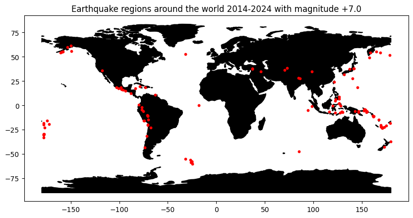
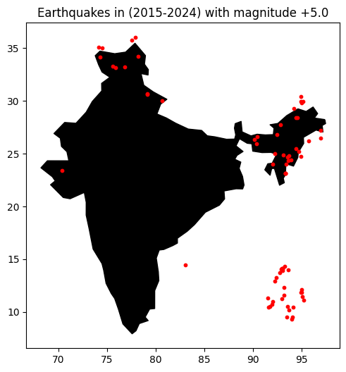

Aim: *Stream real-time Earthquake data through an API and map out vulnerable zones around the world.*

*Additionally, built a function* 'plot_earthquake_data' *to be able to zoom in at country-level and see the vulnerable zones at a local level.*

Data Source: https://earthquake.usgs.gov
